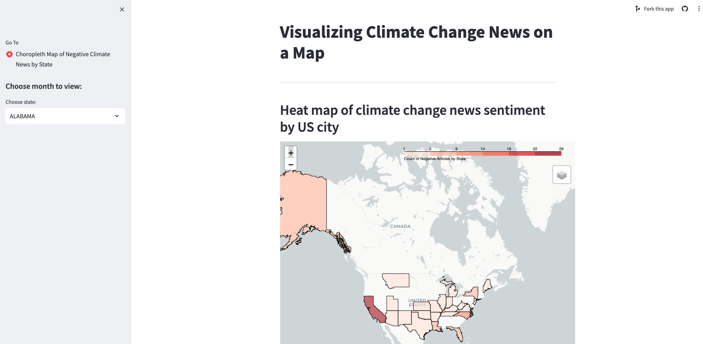
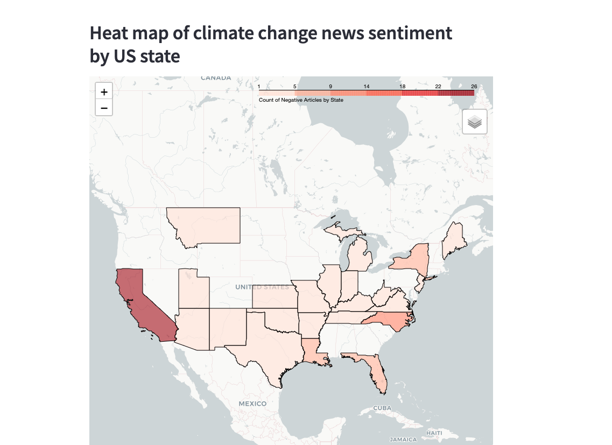

<!-- Improved compatibility of back to top link: See: https://github.com/othneildrew/Best-README-Template/pull/73 -->
<a name="readme-top"></a>
<!--
*** Thanks for checking out the Best-README-Template. If you have a suggestion
*** that would make this better, please fork the repo and create a pull request
*** or simply open an issue with the tag "enhancement".
*** Don't forget to give the project a star!
*** Thanks again! Now go create something AMAZING! :D
-->


<!-- PROJECT SHIELDS -->
<!--
*** I'm using markdown "reference style" links for readability.
*** Reference links are enclosed in brackets [ ] instead of parentheses ( ).
*** See the bottom of this document for the declaration of the reference variables
*** for contributors-url, forks-url, etc. This is an optional, concise syntax you may use.
*** https://www.markdownguide.org/basic-syntax/#reference-style-links
-->


<!-- PROJECT LOGO -->
<!--
<br />
<div align="center">
  <a href="https://github.com/annieco/wid_climate_change_datathon">
    
  </a>
-->

<h3 align="center">Mapping Climate Change News Sentiment</h3>

  <p align="center">
    This project was built by Annie, Thienthanh, and Sarah for the <a href="https://www.womenindata.org/datathon"><strong>WiD 2023 Datathon</strong></a>. The <a href="https://storymaps.arcgis.com/collections/87744e6b06c74e82916b9b11da218d28?item=1"f><strong>Climate Risk Viewer</strong></a> is a tool built by the Forest Service to spacially identify climate-related risks. Our Streamlit-based application is an innovative take on the Climate Risk Viewer that maps climate risk by identifying climate change related news articles by geographic location. In the application, a heatmap shows the quantity of climate change related articles with a negative sentiment. This tool allows users to view climate-related disasters and vulnerabilities using real-time news data.
    <br />
    <a href="https://github.com/annieco29/wid_climate_change_datathon"><strong>Explore the docs »</strong></a>
    <br />
    <br />
    <a href="https://mappingclimatechangenewsdata.streamlit.app">View Demo</a>
    ·
    <a href="https://github.com/annieco29/wid_climate_change_datathon/issues">Request Feature</a>
  </p>
</div>


<!-- TABLE OF CONTENTS -->
<details>
  <summary>Table of Contents</summary>
  <ol>
    <li>
      <a href="#about-the-project">About The Project</a>
      <ul>
        <li><a href="#built-with">Built With</a></li>
      </ul>
    </li>
    <li>
      <a href="#getting-started">Getting Started</a>
    </li>
    <li><a href="#contributing">Contributing</a></li>
    <li><a href="#license">License</a></li>
    <li><a href="#contact">Contact</a></li>
    <li><a href="#acknowledgments">Acknowledgments</a></li>
  </ol>
</details>


<!-- ABOUT THE PROJECT -->
## About The Project
<br />
<div align="center">
  <a href="https://github.com/annieco29/wid_climate_change_datathon">
    
  </a>
  
<!--
Here's a blank template to get started: To avoid retyping too much info. Do a search and replace with your text editor for the following: `github_username`, `repo_name`, `twitter_handle`, `linkedin_username`, `email_client`, `email`, `project_title`, `project_description`
-->

<p align="right">(<a href="#readme-top">back to top</a>)</p>


## Get started guide

#### Clone this repository on your local computer

```
git clone https://github.com/annieco/wid_climate_change_datathon
```

#### Download and Install Anaconda Python 3.7

https://www.anaconda.com/distribution/

#### Change to project folder

```
cd wid_climate_change_datathon
```

#### Create the project environment

```
conda env create
```

wait for the environment to create.

#### Activate the environment (Mac/Linux)
```
conda activate wid_datathon_2023
```

#### Activate the environment (Windows)
```
conda activate wid_datathon_2023
```

Check that your prompt changed to

```
(wid_datathon_2023) $
```

#### Launch Jupyter Notebook to look through web scraping and location matching notebooks

```
jupyter notebook
```

#### Run the streamlit app

```
streamlit run app.py
```

You are good to go! Enjoy!


<p align="right">(<a href="#readme-top">back to top</a>)</p>


<!-- CONTRIBUTING -->
## Contributing

Contributions are what make the open source community such an amazing place to learn, inspire, and create. Any contributions you make are **greatly appreciated**.

If you have a suggestion that would make this better, please fork the repo and create a pull request. You can also simply open an issue with the tag "enhancement".
Don't forget to give the project a star! Thanks again!

1. Fork the Project
2. Create your Feature Branch (`git checkout -b feature/AmazingFeature`)
3. Commit your Changes (`git commit -m 'Add some AmazingFeature'`)
4. Push to the Branch (`git push origin feature/AmazingFeature`)
5. Open a Pull Request

<p align="right">(<a href="#readme-top">back to top</a>)</p>


<!-- LICENSE -->
## License

Distributed under the MIT License. See `LICENSE.txt` for more information.

<p align="right">(<a href="#readme-top">back to top</a>)</p>


<!-- CONTACT -->
## Contact

Project Link: [https://github.com/annieco29/wid_climate_change_datathon](https://github.com/annieco29/wid_climate_change_datathon)

<p align="right">(<a href="#readme-top">back to top</a>)</p>


<!-- ACKNOWLEDGMENTS -->
## Acknowledgments

* [BBC Climate and Science RSS Feed](https://feeds.bbci.co.uk/news/science_and_environment/rss.xml?edition=uk)
* [NASA Earth Observatory RSS Feed](https://earthobservatory.nasa.gov/feeds/earth-observatory.rss)
* [waybackpack](https://github.com/jsvine/waybackpack)
* [Hugging Face](https://huggingface.co/)
* [Cardiff NLP Twitter roBERTa Base Sentiment](https://huggingface.co/cardiffnlp/twitter-roberta-base-sentiment-latest)
* [Streamlit](https://steamlit.io)

<p align="right">(<a href="#readme-top">back to top</a>)</p>


<!-- MARKDOWN LINKS & IMAGES -->
<!-- https://www.markdownguide.org/basic-syntax/#reference-style-links -->
[contributors-shield]: https://img.shields.io/github/contributors/github_username/repo_name.svg?style=for-the-badge
[contributors-url]: https://github.com/github_username/repo_name/graphs/contributors
[forks-shield]: https://img.shields.io/github/forks/github_username/repo_name.svg?style=for-the-badge
[forks-url]: https://github.com/github_username/repo_name/network/members
[stars-shield]: https://img.shields.io/github/stars/github_username/repo_name.svg?style=for-the-badge
[stars-url]: https://github.com/github_username/repo_name/stargazers
[issues-shield]: https://img.shields.io/github/issues/github_username/repo_name.svg?style=for-the-badge
[issues-url]: https://github.com/github_username/repo_name/issues
[license-shield]: https://img.shields.io/github/license/github_username/repo_name.svg?style=for-the-badge
[license-url]: https://github.com/github_username/repo_name/blob/master/LICENSE.txt
[linkedin-shield]: https://img.shields.io/badge/-LinkedIn-black.svg?style=for-the-badge&logo=linkedin&colorB=555
[linkedin-url]: https://linkedin.com/in/linkedin_username
[product-screenshot]: images/screenshot.png
[Next.js]: https://img.shields.io/badge/next.js-000000?style=for-the-badge&logo=nextdotjs&logoColor=white
[Next-url]: https://nextjs.org/
[React.js]: https://img.shields.io/badge/React-20232A?style=for-the-badge&logo=react&logoColor=61DAFB
[React-url]: https://reactjs.org/
[Vue.js]: https://img.shields.io/badge/Vue.js-35495E?style=for-the-badge&logo=vuedotjs&logoColor=4FC08D
[Vue-url]: https://vuejs.org/
[Angular.io]: https://img.shields.io/badge/Angular-DD0031?style=for-the-badge&logo=angular&logoColor=white
[Angular-url]: https://angular.io/
[Svelte.dev]: https://img.shields.io/badge/Svelte-4A4A55?style=for-the-badge&logo=svelte&logoColor=FF3E00
[Svelte-url]: https://svelte.dev/
[Laravel.com]: https://img.shields.io/badge/Laravel-FF2D20?style=for-the-badge&logo=laravel&logoColor=white
[Laravel-url]: https://laravel.com
[Bootstrap.com]: https://img.shields.io/badge/Bootstrap-563D7C?style=for-the-badge&logo=bootstrap&logoColor=white
[Bootstrap-url]: https://getbootstrap.com
[JQuery.com]: https://img.shields.io/badge/jQuery-0769AD?style=for-the-badge&logo=jquery&logoColor=white
[JQuery-url]: https://jquery.com 
